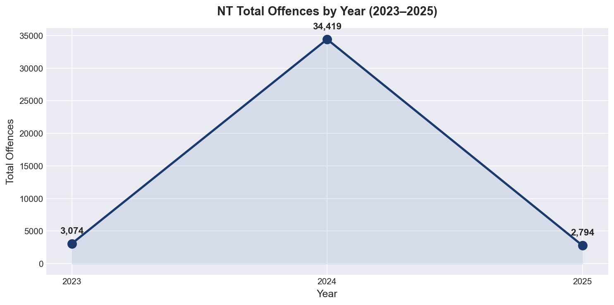
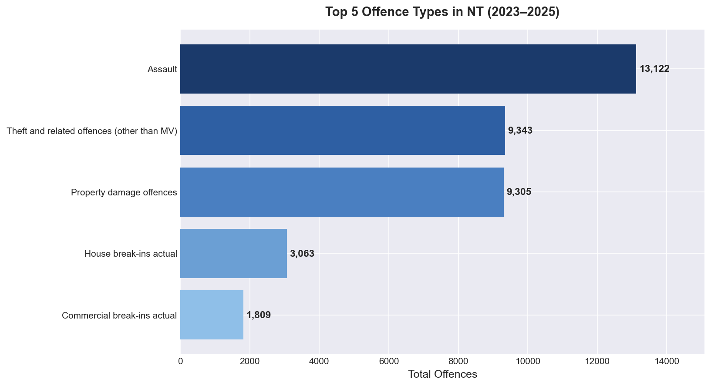
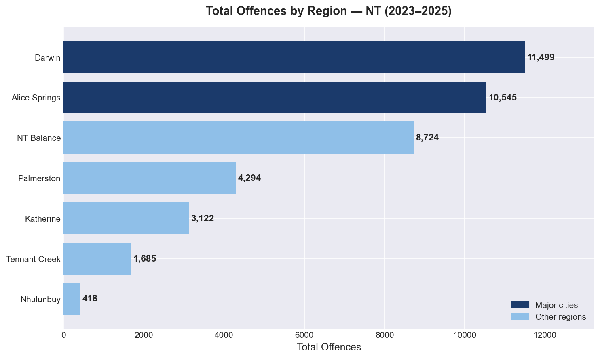
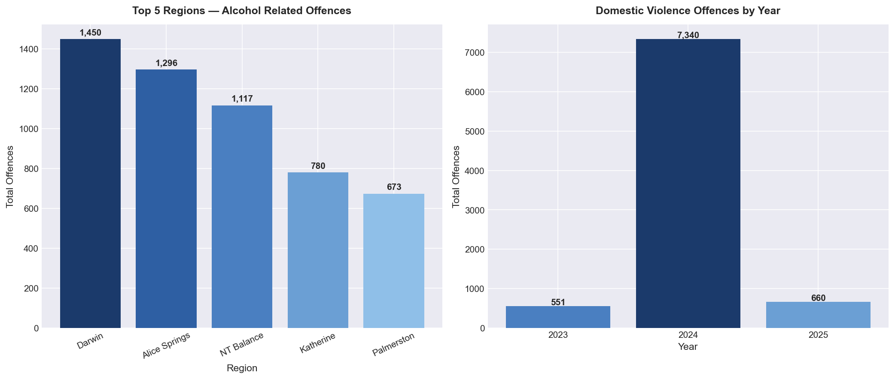

# 🐍 NT Crime Data — Python EDA

## 📌 Project Overview
Exploratory Data Analysis of **NT Police Recorded Offences (2023–2025)** 
using Python. This project uncovers crime trends, regional patterns, 
alcohol involvement, and domestic violence rates across the Northern Territory.

---

## 📊 Visualisations

### Chart 1 — NT Total Offences by Year

### Chart 2 — Top 5 Offence Types

### Chart 3 — Crime by Region

### Chart 4 — Alcohol & Domestic Violence Analysis

---

## 🔍 Key Insights

| Metric | Value |
|--------|-------|
| 📊 Total offences (2023–2025) | 40,287 |
| 👊 #1 Offence type | Assault |
| 📍 Highest crime region | Darwin |
| 🍺 Alcohol-related | 14.4% of all offences |
| 🏠 DV offences 2023 | 551 |
| 🏠 DV offences 2024 | 7,340 |
| 📈 DV increase 2023→2024 | **13.3x** |

**Key Insight:** Alice Springs records crime levels comparable to Darwin 
despite having a 3x smaller population — highlighting a critical 
resource allocation challenge for NT Government.

---

## 🛠️ Tools & Libraries

| Tool | Usage |
|------|-------|
| **Python 3.11** | Core language |
| **Pandas** | Data loading, cleaning, aggregation |
| **Matplotlib** | Chart visualisation |
| **Seaborn** | Styling & themes |

---

## 📁 Dataset
- **Source:** NT Government Open Data
- **Dataset:** NT Police Recorded Offences
- **Coverage:** Northern Territory, 2023–2025
- **Link:** [data.nt.gov.au](https://data.nt.gov.au/dataset/nt-crime-statistics-january-2025)

---

## 👤 Author
**Quoc Chien Kieu (Nolan)**  
Data Analyst | Darwin, NT  
[LinkedIn](https://linkedin.com/in/quoc-chien-kieu) ·
[GitHub](https://github.com/chien-kieu)
